# Subject: R&D Strategy Agent

HBM4, PIM, CXL 관련 반도체 기술의 최신 웹·문서 근거를 수집하고 경쟁사 동향을 분석하여, R&D 의사결정에 활용할 수 있는 짧고 구조화된 전략 보고서를 생성하는 워크플로우입니다.

## Overview

- Objective :
  HBM4, PIM, CXL 관련 최신 자료를 바탕으로 경쟁사 동향과 기술 전략 시사점을 정리한 보고서를 생성합니다.
- Method :
  경쟁사 선정 -> Web Search -> 문서 기반 분석(RAG-like) -> 초안 생성 -> 검증/수정 -> Markdown/PDF 변환의 순차형 agent workflow를 사용합니다.
- Tools :
  OpenAI API, Tavily, PyMuPDF, ReportLab, Python

## Features

- PDF 자료 및 메타데이터 기반 정보 추출
- HBM4, PIM, CXL 대상 최신 웹 정보 수집
- 경쟁사 후보 탐색 및 분석 대상 선정
- 구조화된 기술 전략 보고서 초안 생성
- 검증 및 수정 루프를 통한 보고서 보완
- Markdown 및 PDF 결과물 저장
- 확증 편향 완화 전략 : 기술별 균형 쿼리 분배, 허용 도메인 기반 검색, 검증 단계 재확인

## Tech Stack

| Category  | Details                                       |
| --------- | --------------------------------------------- |
| Framework | Python                                        |
| LLM       | `gpt-4o-mini` via OpenAI API                  |
| Retrieval | Tavily Web Search, local PDF/metadata loading |
| Parsing   | PyMuPDF                                       |
| Reporting | Markdown, ReportLab PDF                       |
| Env Mgmt  | uv, python-dotenv                             |

## Agents

- Competitor Discovery Agent: 기술별 경쟁사 후보군 구성
- Web Search Agent: 최신 뉴스/공식 발표 검색 및 근거 수집
- RAG Agent: 로컬 문서와 메타데이터 기반 분석 입력 구성
- Draft Generation Agent: 보고서 초안 및 수정본 생성
- Review / Validation Agent: 구조, 근거성, 시사점 기준 검토
- Formatting Node: 최종 보고서 PDF 포맷 처리

## Architecture



## Directory Structure

```text
├── data/                  # PDF 문서 및 메타데이터
├── agents/                # Agent 모듈
├── nodes/                 # 포맷팅 노드
├── prompts/               # 프롬프트 템플릿
├── outputs/               # 분석 결과 및 보고서 저장
├── app.py                 # 실행 스크립트
└── README.md
```

## Contributors

- 윤정원 : Agent Design, Prompt Engineering, Workflow Implementation
